# EasyTicket — Plateforme de billetterie événementielle

## 📌 Présentation

**EasyTicket** est une plateforme web de billetterie événementielle permettant aux utilisateurs de découvrir des événements, consulter leurs détails et effectuer une réservation avec un parcours de paiement en ligne.

La solution intègre également un **espace d'administration** permettant de gérer les événements depuis une interface dédiée.

Le projet a été développé avec **Laravel** et **Backpack for Laravel**,avec une séparation entre l'interface publique destinée aux utilisateurs et l'interface d'administration.

---

## 🎯 Objectifs du projet

Le projet avait pour objectifs de:

* proposer une plateforme centralisée de découverte d'événements;
* permettre aux utilisateurs de consulter les informations détaillées des événements;
* faciliter l'inscription et la connexion des utilisateurs;
* proposer un parcours de réservation et de paiement;
* offrir une interface simple et responsive;
* mettre à disposition une administration permettant de gérer les événements;
* structurer la solution autour d'un framework web moderne.

---

## 🎟️ Fonctionnalités principales

### 🌐 Interface utilisateur

La plateforme permet aux visiteurs et utilisateurs de:
* consulter les événements disponibles;
* découvrir les détails d'un événement;
* accéder aux informations pratiques;
* créer un compte;
* se connecter à leur espace;
* parcourir les différentes pages de la plateforme;
* accéder à la page de contact;
* consulter les informations relatives à la plateforme.

### 🎫 Parcours événement

Chaque événement dispose d'une page dédiée permettant notamment de consulter ses informations avant de procéder à une réservation.

Le parcours comprend:
1. découverte de l'événement;
2. consultation des détails;
3. réservation;
4. accès au processus de paiement.

---

## 💳 Parcours de paiement

EasyTicket intègre un parcours de paiement organisé en plusieurs étapes.

Les captures présentent notamment:

* **Étape 1 du paiement**
* **Étape 2 du paiement**
* progression de l'utilisateur dans le processus de paiement.

L'objectif est de proposer un parcours clair permettant à l'utilisateur de finaliser sa réservation.

---

## 👤 Gestion des utilisateurs

La plateforme comprend un système permettant aux utilisateurs de:

* s'inscrire;
* se connecter;
* accéder aux fonctionnalités réservées aux utilisateurs authentifiés;
* effectuer leurs opérations liées à la billetterie.

---

## 🛠️ Administration — Backpack

L'administration de la plateforme repose sur **Backpack for Laravel**.

L'espace d'administration permet notamment de gérer les événements à travers une interface dédiée.

### Fonctionnalités d'administration

* connexion à l'administration;
* tableau de bord;
* gestion des événements;
* ajout d'événements;
* modification d'événements;
* aperçu d'un événement;
* gestion des données depuis l'interface Backpack.

Cette architecture facilite la gestion du contenu de la plateforme sans modifier directement les données depuis la base de données.

---

## 🖥️ Architecture du projet

Le projet repose sur le framework **Laravel**,permettant d'organiser l'application autour d'une architecture structurée.

Les principales responsabilités sont séparées entre:

* interface utilisateur;
* logique métier;
* gestion des utilisateurs;
* gestion des événements;
* processus de réservation;
* paiement;
* administration;
* accès aux données.

L'utilisation de Laravel facilite également la maintenance et l'évolution de la plateforme.

---

## 🎨 Interface & expérience utilisateur

L'interface publique a été conçue pour proposer une navigation simple et orientée vers la découverte des événements.

Une attention particulière a été portée à:

* la présentation des événements;
* la lisibilité des informations;
* le parcours utilisateur;
* la simplicité de navigation;
* la séparation entre espace public et administration.

---

## 🔐 Administration & sécurité

L'accès aux fonctionnalités d'administration est séparé de l'interface publique.

L'utilisation de **Backpack for Laravel**permet de disposer d'une interface d'administration dédiée pour la gestion des données de la plateforme.
Les fonctionnalités sensibles sont ainsi réservées aux utilisateurs autorisés.

---

## 🧰 Technologies utilisées

| Domaine           | Technologies                  |
| ----------------- | ----------------------------- |
| Framework Backend | Laravel                       |
| Langage           | PHP                           |
| Administration    | Backpack for Laravel          |
| Frontend          | HTML5, CSS3, JavaScript       |
| Base de données   | Base de données relationnelle |
| Authentification  | Laravel                       |
| Paiement          | EasyTicket Payment            |
| Versioning        | Git                           |
| Architecture      | MVC                           |

---

## 📸 Aperçu

### 🏠 Accueil

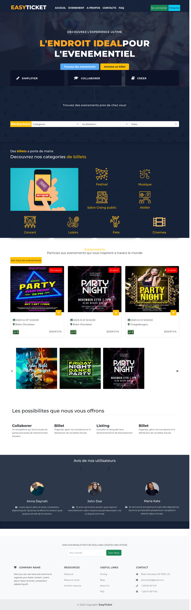

### 🎟️ Événements

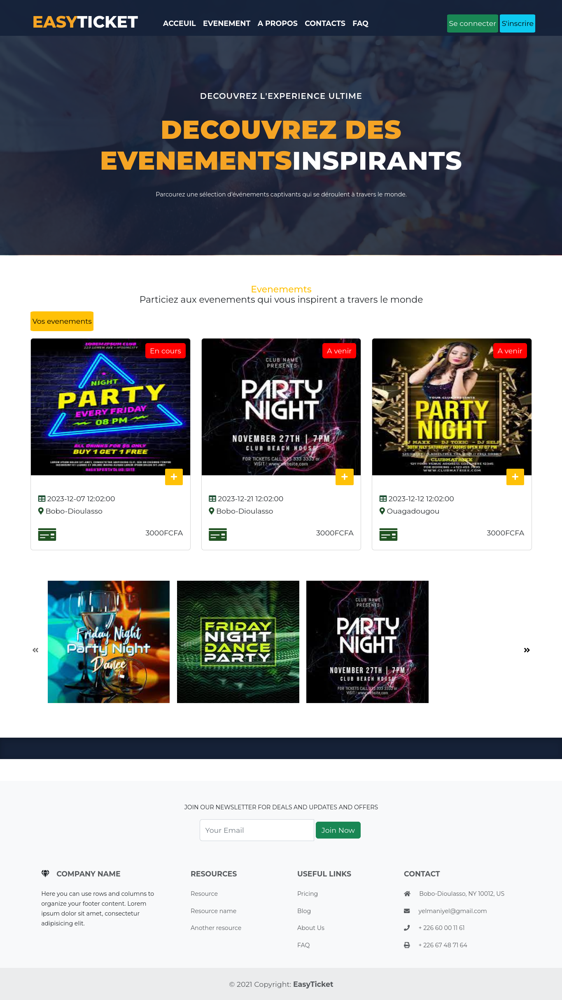

### 🔎 Détail d'un événement

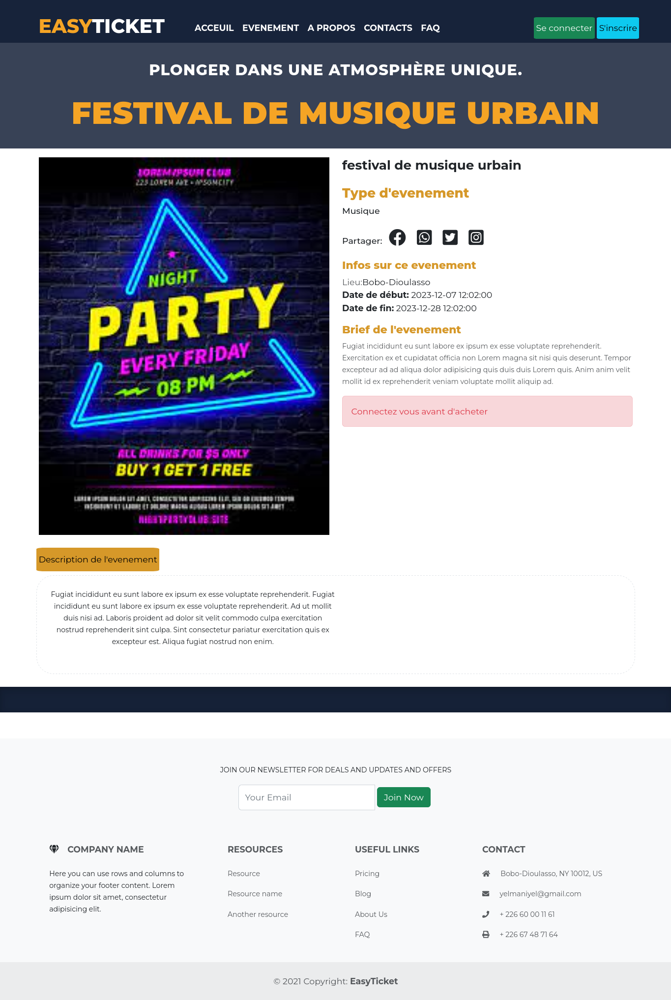

### 📝 Inscription

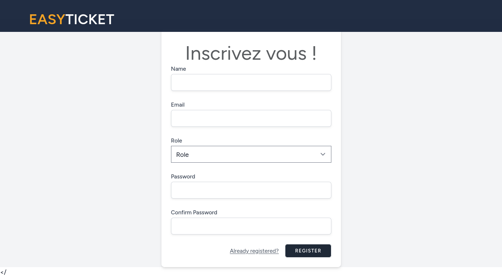

### 🔐 Se connecter

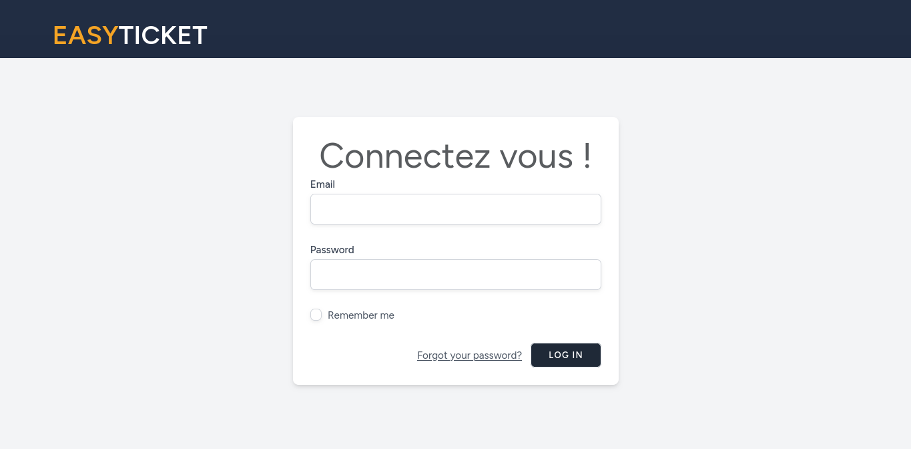

### 📞 Contact

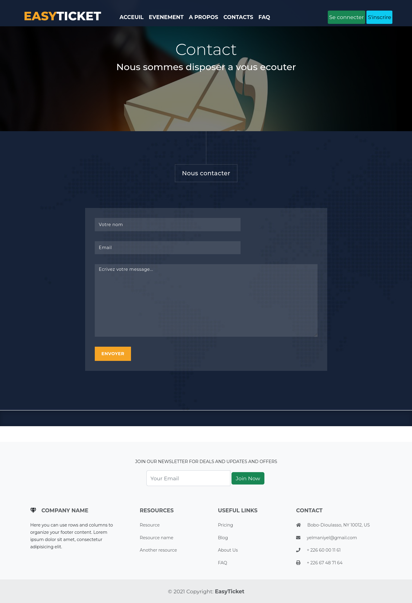

### ℹ️ À propos

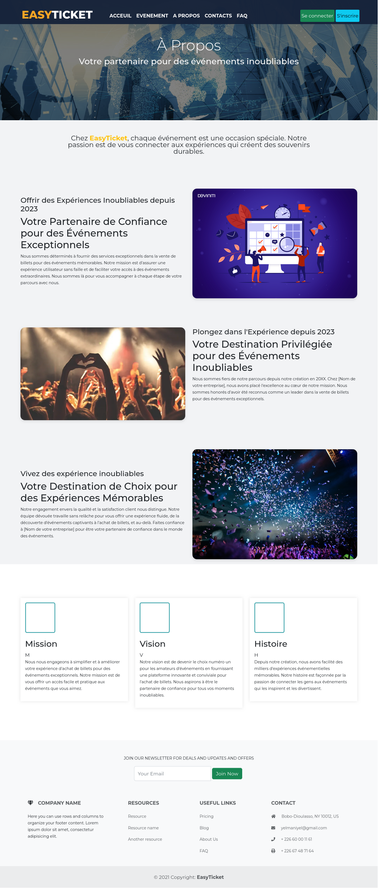

### 💳 Paiement — Étape 1

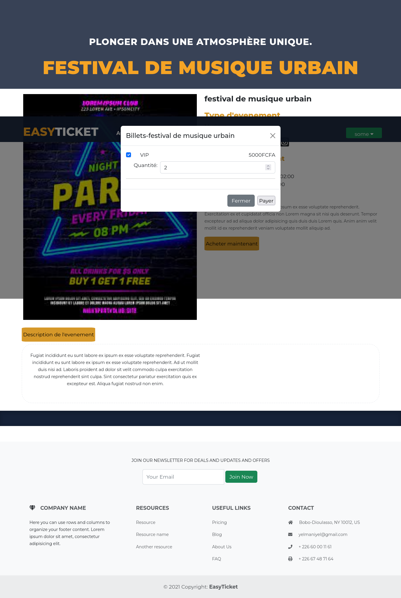

### 💳 Paiement — Étape 2

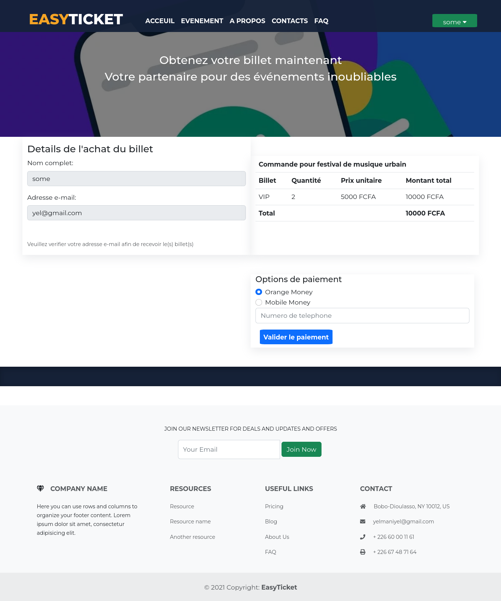

---

## 🛡️ Aperçu de l'administration Backpack

### 🔐 Connexion à l'administration

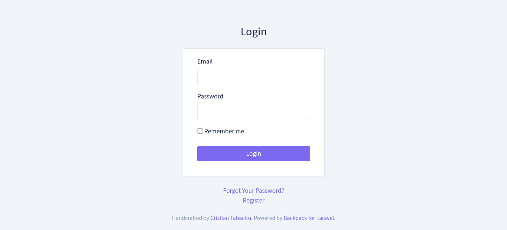

### 📊 Dashboard

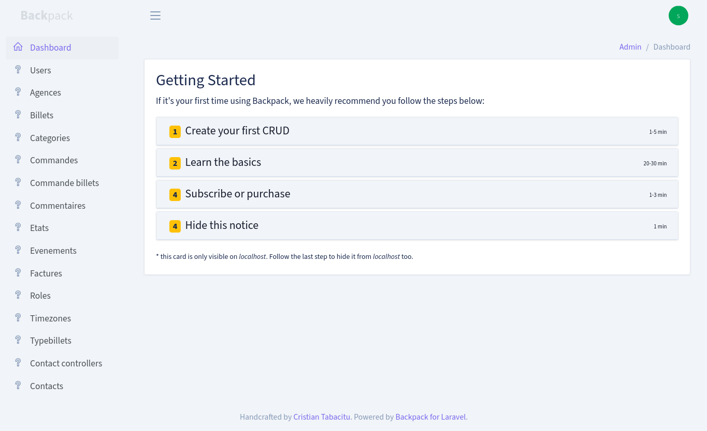

### 🏢 Exemple de gestion des données

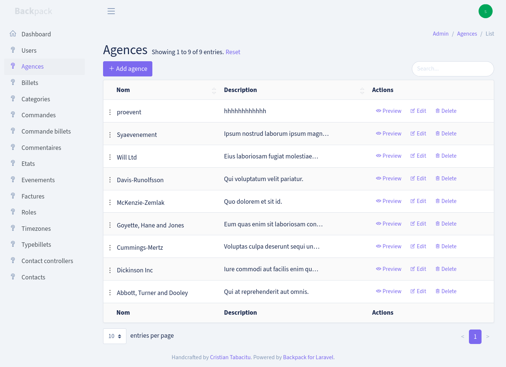

### ➕ Ajouter un événement

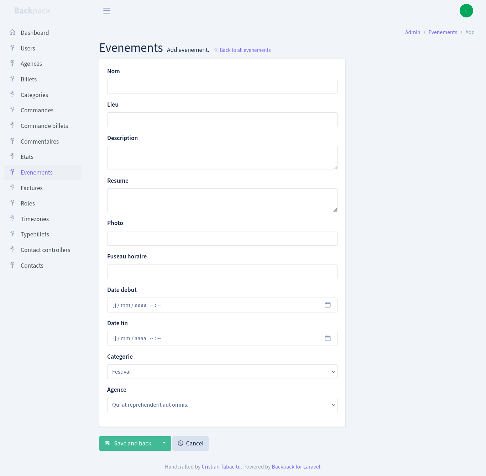

### ✏️ Modifier un événement

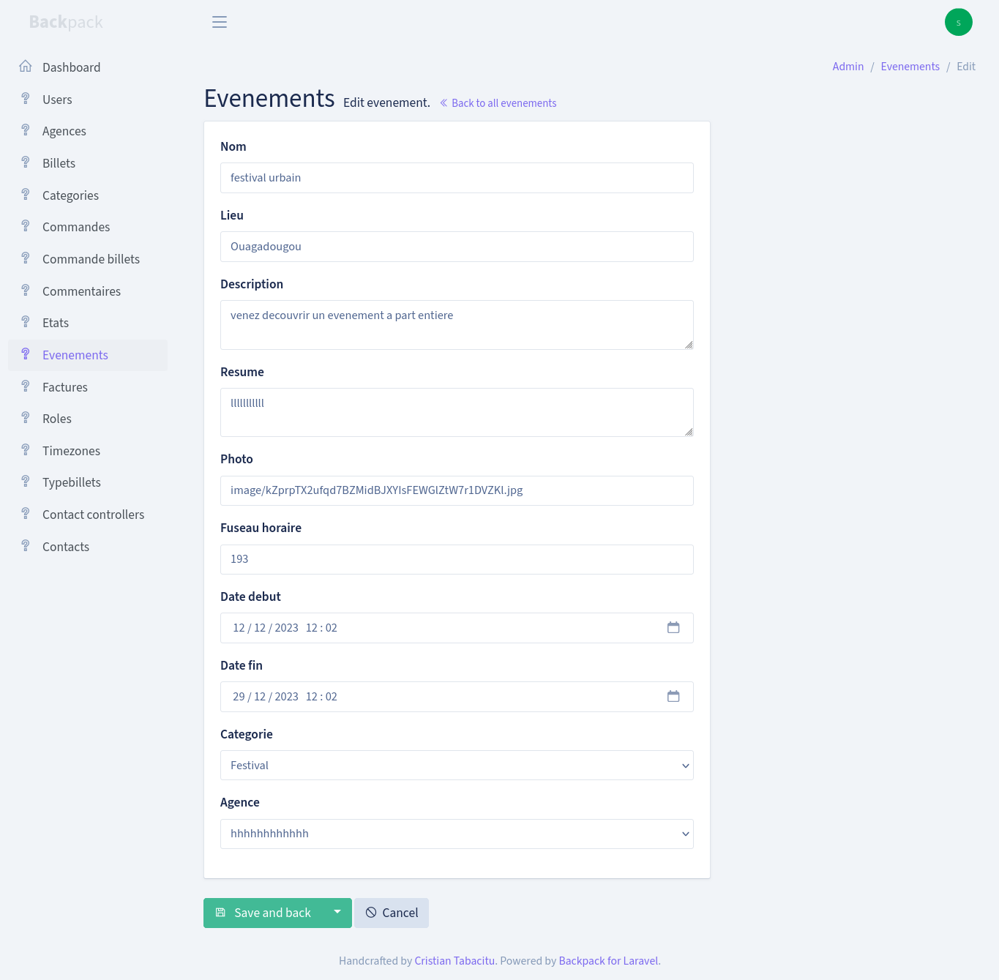

### 👁️ Prévisualiser un événement

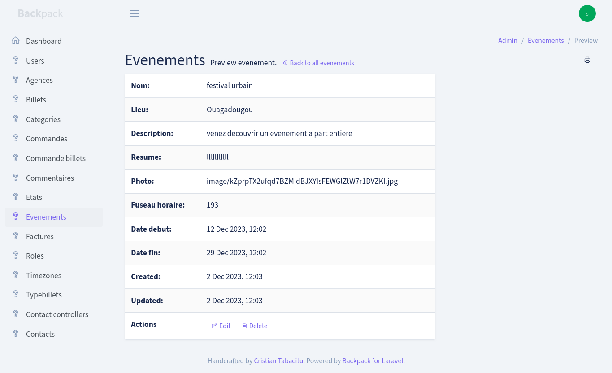

---

## 👨‍💻 Rôle dans le projet

**Développement Web — Laravel**

Interventions sur les différentes composantes de la plateforme:

* conception et développement de la plateforme;
* développement backend avec Laravel;
* développement de l'interface utilisateur;
* mise en place de l'authentification;
* développement du système de gestion des événements;
* développement du parcours de réservation;
* intégration du processus de paiement;
* mise en place de l'administration avec Backpack;
* développement des fonctionnalités CRUD;
* gestion de la base de données;
* organisation du projet selon l'architecture MVC;
* gestion du versioning avec Git.

---

## 📂 Confidentialité du projet

Ce repository est présenté dans le cadre d'un **portfolio professionnel**.

Les captures permettent de présenter les fonctionnalités et l'interface de la solution sans exposer d'informations sensibles ou de données confidentielles.

---
